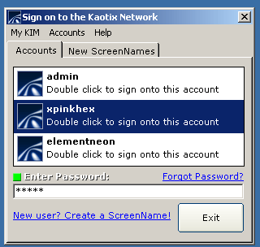



## Kaotix Instant Messenger 1\.0\.2

### Description

Version 1.0.2 of my instant messenger is basically just another update to the sign on dialog. I added a few features like "change account icon" and I also changed the way it works -- now all you have to do is enter the password and double click the account name. By the way, the password for all three preloaded accounts is admin. Anyway, next I'll be working on the server a little more and then maybe some other stuff like the chat window. I'm gonna add MD5 encryption because hey, if its good enough for AIM and MSN Messenger, its good enough for KIM lol
 
### More Info
 

             |
---                |---
**Submitted On**   |2002-02-22 10:28:48
**By**             |[neurokaotix](https://github.com/Planet-Source-Code/PSCIndex/blob/master/ByAuthor/neurokaotix.md)
**Level**          |Intermediate
**User Rating**    |4.7 (56 globes from 12 users)
**Compatibility**  |VB 5\.0, VB 6\.0, VBA MS Access
**Category**       |[Internet/ HTML](https://github.com/Planet-Source-Code/PSCIndex/blob/master/ByCategory/internet-html__1-34.md)
**World**          |[Visual Basic](https://github.com/Planet-Source-Code/PSCIndex/blob/master/ByWorld/visual-basic.md)
**Archive File**   |[Kaotix\_Ins568392222002\.zip](https://github.com/Planet-Source-Code/neurokaotix-kaotix-instant-messenger-1-0-2__1-32026/archive/master.zip)

